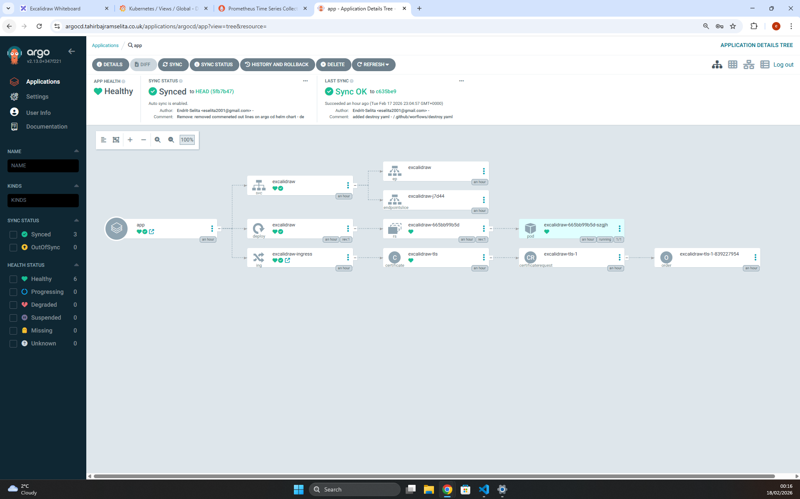
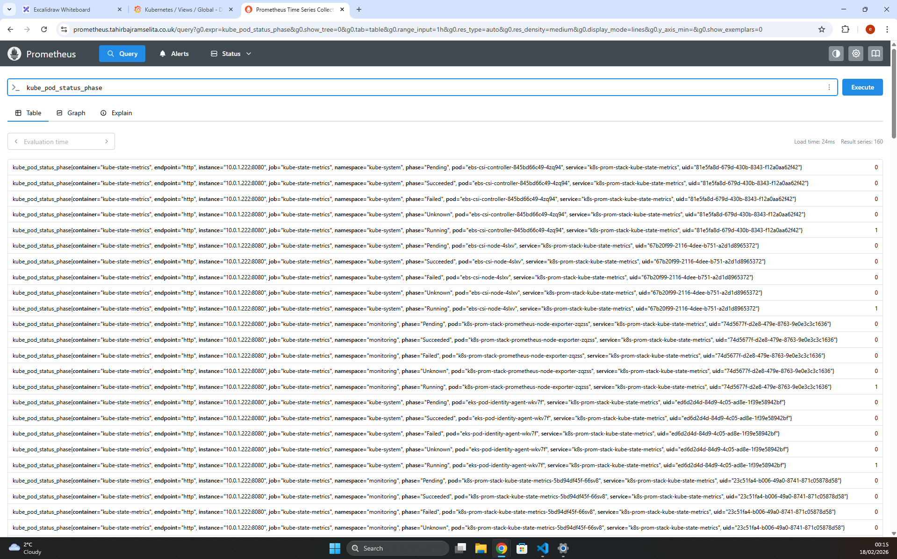
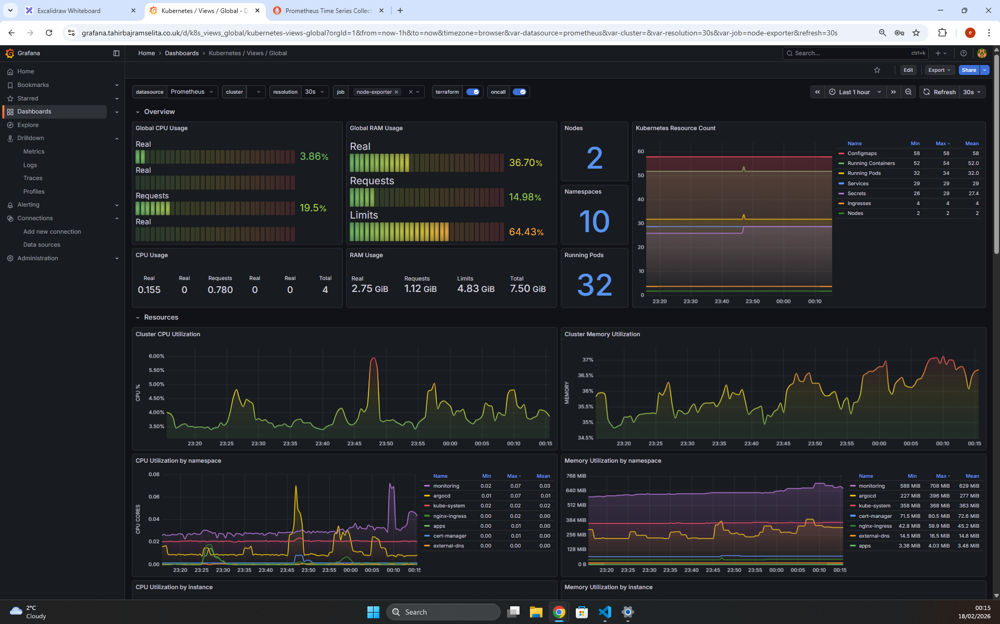

<div align="center">
  
  <h1 style="font-size: 2.5em;">Excalidraw Whiteboard Deployed on EKS</h1>
<p>
    <a href="#"></a>
    <a href="#"></a>
    <a href="#"></a>
    <a href="#"></a>
    <a href="#"></a>
  
  <br>
  <p>
    <a href="#"></a>
    <a href="#"></a>
    <a href="#"></a>
    <a href="#"></a>
    
  </p>
</div>

---

## Introduction
This project is a scalable, production grade deployment of the Excalidraw whiteboarding app on an EKS cluster. The deployment is distributed across multiple AZ's for high availability and utilises EKS Managed Node Groups with auto-scaling capabilities. Infrastructure is fully automated using Terraform, while the application is containerised with Docker and delivered via GitHub Actions CICD pipelines that feeds into ArgoCD for GitOps deployment. The application is packaged and deployed using Helm, with NGINX Ingress for traffic management.

### Why Excalidraw
Excalidraw is an open source virtual whiteboard for sketching diagrams and technical flows. It is included in this project because teams lose time and accuracy when ideas live only in calls, chat screenshots, or scattered notes, and clear visuals remove this problem. It also bridges the gap between technical and non-technical stakeholders by giving everyone a simple, shared way to explain and review ideas. Excalidraw turns discussions into shareable files that can be exported and embedded into documentation . **I designed the architecture diagram below using the actual application I deployed on this repo at exd.tahirbajramselita.co.uk**

## Architecture diagram (built on Excalidraw app hosted on exd.tahirbajramselita.co.uk)

<div align="center">
  
  </div>

## Key Features
- **External-DNS**: Automatically creates AWS Route 53 DNS records for all Kubernetes Services and Ingress.
- **Cert-Manager**: Automaticaly issues and renews Let's Encrypt SSL certificates for secure HTTPS traffic..
- **ArgoCD**: Maintains the cluster state by continuously syncing Kubernetes manifests from the Git repository.
- **Helm Integration**: Manages platform dependencies efficiently.
- **Prometheus & Grafana**: Visualises critical cluster health, node performance, and application metrics in real time.
- **OIDC Authentication**: Replaces long lived AWS keys with OpenID Connect for secure, temporary, least privilege access.

## Project Structure

```
Excalidraw-EKS/
├── .github/workflows/
│   ├── apply.yml
│   ├── destroy.yml
│   ├── docker_build_push.yml
│   └── terraform_plan.yml
├── app/
│   ├── Dockerfile
│   ├── nginx.conf
│   └── .dockerignore
 deployment/
│   ├── apps/
│   │   └── excalidraw_deployment.yaml
│   ├── argo-cd/
│   │   └── apps-argo.yaml
│   ├── cert-man/
│   │   └── issuer.yaml
│   ├── helm-values/
│   │   ├── argocd.yaml
│   │   ├── certmanager.yaml
│   │   ├── external-dns.yaml
│   │   └── prometheus_grafana.yaml
│   ├── scripts/
│   │   └── destroy.sh
│   └── terraform/
│       ├── eks.tf
│       ├── helm.tf
│       ├── locals.tf
│       ├── pod-identities.tf
│       ├── providers.tf
│       └── vpc.tf
├── images/
├── .gitignore
└── README.md

```

---

## Project Core Components

### Docker
  
- **Multi Stage Builds**: Separates the build environment (Node.js/Yarn) from the runtime environment (Nginx), **reducing the final image size by over 90%** and removing build tools from production.
- **Non-Root User**: Configured Nginx to run as a non-root user to prevent malicious access and attacks.
- **Trivy scans**: Automated image scanning for any CVEs before they're pushed to the next stage of the pipeline

<div align="center">
  
  </div>
  
  
### Terraform

- **Modular Architecture:** Implements DRY principles by leveraging community built Terraform modules to ensure standardised, production ready infrastructure components.
- **Automated Linting:** Integrated `tflint` and `terraform fmt` into the CICD pipeline to enforce strict syntax standards and catch potential errors before they reach the planning stage.
- **Checkov Scanning:** Utilises **Checkov** to automatically scan infrastructure code for misconfigurations and compliance violations, ensuring security best practices.
- **Remote State Management:** Configured with an S3 backend with native state locking (as AWS moves to deprecate DynamoDB locking) to prevent modification conflicts in teams.
- **Pod Identity (IAM):** Replaces legacy IRSA with the modern **EKS Pod Identity Agent** to securely grant AWS permissions to specific service accounts.

### Helm
- **Package Manager**: Acts as the package manager for the Kubernetes cluster, streamlining the installation of complex third-party applications like Nginx Ingress, Cert-Manager, and ArgoCD.
- **Value Configuration**: Uses custom values files (stored in `deployment/helm-values/`) to override default chart settings, allowing for specific configurations

### ArgoCD (GitOps)

- **Automated Deployment:** ArgoCD runs inside the cluster and continuously monitors the GitHub repository, automatically syncing any changes to the live environment without manual `kubectl` commands.
- **Chnage Detection:** It ensures the cluster always matches the "desired state" defined in Git. If someone manually changes a resource, ArgoCD detects the difference and can automatically self-heal the cluster.
- **Visual Application Tree:** As shown in the screenshot, it visualises the entire dependency graph (Ingress > Service > Deployment > Pods), providing instant feedback on the health and sync status of every component.

 <div align="center">
  
  </div>

  ### Prometheus & Grafana (Observability)

#### Prometheus
- **Cluster Monitoring:** Prometheus scrapes metrics from multiple sources, including the NGINX Ingress Controller, application pods, and the EKS control plane itself, providing a comprehensive view of system health.
- **Node Exporter:** Runs on each Kubernetes node to capture critical hardware metrics like CPU usage, memory consumption, and disk I/O, ensuring infrastructure bottlenecks are quickly identified.

 <div align="center">
  
  </div>
  
#### Grafana
- **Visual Dashboards:** Grafana transforms raw Prometheus data into readable, interactive dashboards, making it easy to spot trends and anomalies at a glance.
- **Automated Configuration:** Deployed together via the `kube-prometheus-stack` Helm chart, with Prometheus automatically configured as Grafana’s data source out of the box.

 <div align="center">
  
  </div>

### CI/CD Pipelines (GitHub Actions)

#### 1. Docker Build & Push (Application CI)
- **Builds the Dockerfile**
- **Secure ECR Push:** Authenticates via **OIDC** (OpenID Connect) to push the verified image to a private Amazon ECR repository
- **Trivy Vulnerability Scan:** Automatically scans the built Docker image for known CVEs (Common Vulnerabilities and Exposures) before pushing, blocking the pipeline if critical issues are found.

#### 2. Terraform Plan (Infrastructure CI)
- **Checkov Security Scan:** Scans Terraform code for misconfigurations (e.g., open security groups, unencrypted storage) and blocks the pipeline if critical issues are found.
- **Linting & Validation:** Runs `terraform fmt` and `tflint` to enforce strict syntax standards and catch potential errors early.
- **Detailed Plan:** Generates a comprehensive execution plan so reviewers can verify exactly what resources will be created or modified before merging.

#### 3. Terraform Apply (Infrastructure CD)
- **Terraform Apply:** Executes `terraform apply -auto-approve` to provision or update the AWS infrastructure
- **Cluster Bootstrapping:** After infrastructure is ready, the pipeline updates `kubeconfig` and immediately applies critical Kubernetes manifests:
    - **Cert-Manager Issuer:** Configures the cluster to request Let's Encrypt certificates automatically.
    - **ArgoCD:** Deploys the root ArgoCD application, which then takes over to sync the rest of the stack (Excalidraw, Prometheus, etc.).

#### 4. Infrastructure Destroy (Cleanup)
- **One-Click Teardown:** Executes a custom script (`destroy.sh`) to destroys all resources to prevent cost overruns.


## Run Locally:

Copy the contents of ```app/``` into your local machine. Then run:

```bash 
yarn install
yarn build

npx servve -s build -p 3000
```
You can then access on localhost:3000


