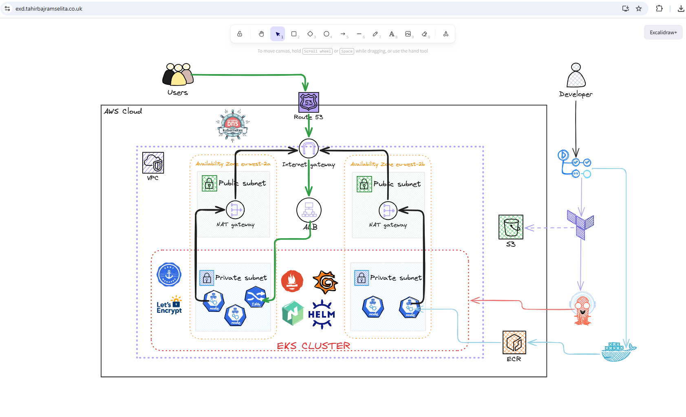

  
  <h1 style="font-size: 2.5em;">Excalidraw Whiteboard Deployed on EKS</h1>

    
    
    
    
    
  
   
  

    
    
    
    
    
  

---

## Introduction
This project is a scalable, production grade deployment of the Excalidraw whiteboarding app on an EKS cluster. The deployment is distributed across multiple AZ's for high availability and utilises EKS Managed Node Groups with auto-scaling capabilities. Infrastructure is fully automated using Terraform, while the application is containerised with Docker and delivered via GitHub Actions CICD pipelines that feeds into ArgoCD for GitOps deployment. The application is packaged and deployed using Helm, with NGINX Ingress for traffic management.

### Why Excalidraw
This application serves as a critical tool for secure visual collaboration. It allows technical teams to map out complex cloud architectures and system flows within a sovereign, self hosted environment. By keeping these diagrams private rather than using public SaaS alternatives, clients ensure strict data governance and prevent sensitive intellectual property from leaving their controlled infrastructure. I designed the architecture diagram below using the actual I application deployed on this repo at exd.tahirbajramselita.co.uk

## Architecture diagram on Excalidraw (deployed on exd.tahirbajramselita.co.uk)

  
  

